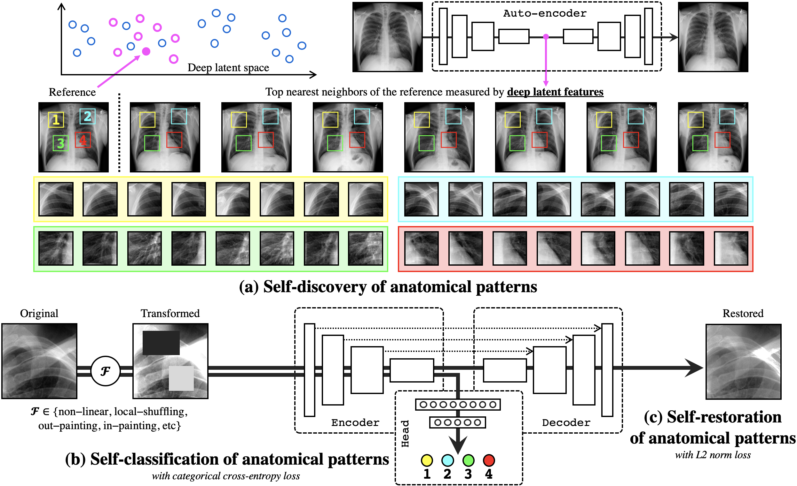
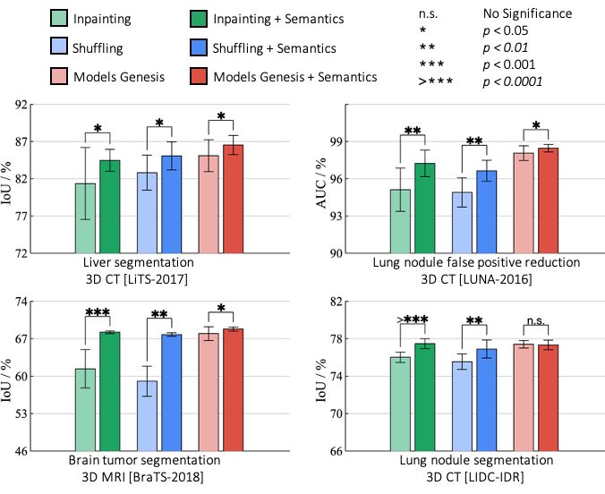
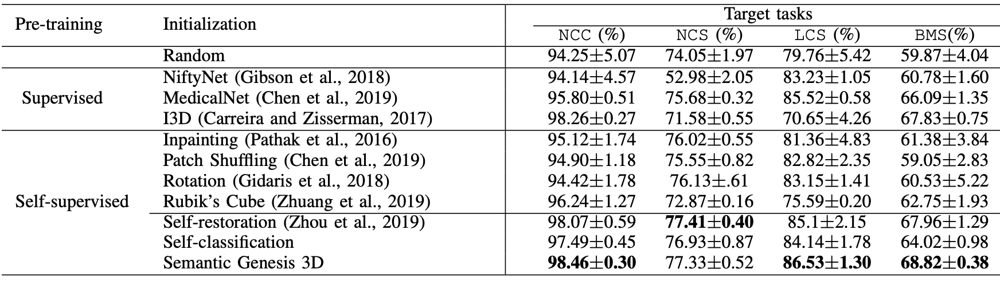

<p align="center"></p>

--------------------------------------------------------------------------------

We have trained deep models to learn semantically enriched visual representation by self-discovery, self-classification, and self-restoration of the anatomy underneath medical images, resulting in a semantics-enriched, general-purpose, pre-trained 3D model, named <b> Semantic Genesis </b>.  Not only does our self-supervised framework outperform existing methods, but also it can be used as an  <b> add-on </b> to improve existing representation learning methods. This key contribution enables many representation learning methods to learn <b> semantics-enriched </b>  representations from unlabeled medical images, a remarkable achievement in general-purpose representation learning. 
&nbsp;&nbsp;&nbsp;&nbsp;&nbsp;&nbsp;&nbsp;&nbsp;&nbsp;&nbsp;&nbsp;&nbsp;&nbsp;&nbsp;&nbsp;&nbsp;&nbsp;&nbsp;&nbsp;&nbsp;&nbsp;&nbsp;&nbsp;

<p align="center"></p>


## Paper
This repository provides the official implementation of training Semantic Genesis as well as using the pre-trained Semantic Genesis in the following paper:

<b>Learning Semantics-enriched Representation via Self-discovery, Self-classification, and Self-restoration</b> <br/>

[Fatemeh Haghighi](https://github.com/fhaghighi)<sup>1</sup>, [Mohammad Reza Hosseinzadeh Taher](https://github.com/MR-HosseinzadehTaher)<sup>1</sup>, [Zongwei Zhou](https://github.com/MrGiovanni)<sup>1</sup>, [Michael B. Gotway](https://www.mayoclinic.org/biographies/gotway-michael-b-m-d/bio-20055566)<sup>2</sup>, [Jianming Liang](https://chs.asu.edu/jianming-liang)<sup>1</sup><br/>
Arizona State University<sup>1</sup>, </sup>Mayo Clinic <sup>2</sup><br/>
International Conference on Medical Image Computing and Computer Assisted Intervention ([MICCAI](https://www.miccai2020.org/)), 2020 <br/>

[Paper](https://arxiv.org/pdf/2007.06959.pdf) | [Code](https://github.com/fhaghighi/SemanticGenesis/) | [Poster](http://www.cs.toronto.edu/~liang/Publications/SemanticGenesis/Semantic_Genesis_Poster.pdf) | [Slides](http://www.cs.toronto.edu/~liang/Publications/SemanticGenesis/Semantic_Genesis_slides.pdf) | [Graphical abstract](http://www.cs.toronto.edu/~liang/Publications/SemanticGenesis/Semantic_Genesis_Graphical_abstract.pdf) | Talk ([YouTube](https://www.youtube.com/embed/II4VkS9Lkdo), [YouKu](https://v.youku.com/v_show/id_XNDkwNzM3MzY4OA==.html)) 

## Available implementation
[](keras/)
&nbsp;&nbsp;&nbsp;&nbsp;&nbsp;
[](pytorch/)
&nbsp;&nbsp;&nbsp;&nbsp;&nbsp;&nbsp;&nbsp;&nbsp;&nbsp;&nbsp;&nbsp;&nbsp;&nbsp;&nbsp;&nbsp;&nbsp;&nbsp;&nbsp;&nbsp;&nbsp;&nbsp;&nbsp;&nbsp;

## Major results from our work
1. **Learning semantics through our proposed self-supervised learning framework enriches existing self-supervised methods**

<p align="center"></p>


2. **Semantic Genesis outperforms:**
    * **3D models trained from scratch**
     * **3D self-supervised pre-trained models**
     * **3D supervised pre-trained models**
     
<p align="center"></p>

Credit to [superbar](https://github.com/scottclowe/superbar) by Scott Lowe for Matlab code of superbar.


## Citation
If you use this code or use our pre-trained weights for your research, please cite our paper:

```
@InProceedings{haghighi2020learning,
author="Haghighi, Fatemeh and Hosseinzadeh Taher, Mohammad Reza and Zhou, Zongwei and Gotway, Michael B. and Liang, Jianming",
title="Learning Semantics-Enriched Representation via Self-discovery, Self-classification, and Self-restoration",
booktitle="Medical Image Computing and Computer Assisted Intervention -- MICCAI 2020",
year="2020",
publisher="Springer International Publishing",
address="Cham",
pages="137--147",
isbn="978-3-030-59710-8",
url="https://link.springer.com/chapter/10.1007%2F978-3-030-59710-8_14"
}
```

## Acknowledgement
This research has been supported partially by ASU and Mayo Clinic through a Seed Grant and an Innovation Grant, and partially by the NIH under Award Number R01HL128785. The content is solely the responsibility of the authors and does not necessarily represent the official views of the NIH. This work has utilized the GPUs provided partially by the ASU Research Computing and partially by the Extreme Science and Engineering Discovery Environment (XSEDE) funded by the National Science Foundation (NSF) under grant number ACI-1548562. We thank [Zuwei Guo](https://www.linkedin.com/in/zuwei/) for implementing Rubik's cube, [M. M. Rahman Siddiquee](https://github.com/mahfuzmohammad) for examining NiftyNet, and [Jiaxuan Pang](https://www.linkedin.com/in/jiaxuan-pang-b014ab127/) for evaluating I3D. The content of this paper is covered by patents pending. 


## License

Released under the [ASU GitHub Project License](https://github.com/fhaghighi/SemanticGenesis/blob/master/LICENSE).
